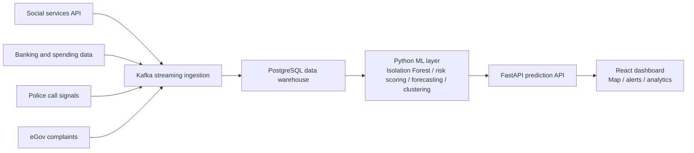

# SocialRadar Frontend

SocialRadar is a frontend-first GovTech analytics platform for the `AI inDrive / Decentrathon 5.0` case. In its current form, the product is a Palantir-style social risk intelligence console that helps monitor district-level and regional signals relevant to urban management and public-sector decision support.

## What the project is

SocialRadar is a monitoring and decision-support interface that combines:

- Almaty district map
- regional labor-market indicators
- migration and demographic signals
- sortable region ranking
- district demographic profile
- visible compliance and governance guardrails

In practical terms, this is a frontend for analysts, city teams, and public-sector experts who need to see where social pressure, demographic load, or service-demand signals may be growing.

## Current scope of the prototype

The current submission is intentionally frontend-first:

- premium Palantir-style web interface
- Almaty district visualization
- regional comparison workspace
- trend analytics for employment, unemployment, migration, and outside-labor-force indicators
- live district risk snapshot support through Railway
- compliance-ready shell for later FastAPI and ML integration

## Architecture

Current target architecture for SocialRadar:



Current stage delivered in this repository:

- React dashboard and analytics shell
- district map and regional monitoring UI
- live district snapshot integration through Railway
- compliance and explainability-ready interface layer

Planned next stage:

- FastAPI integration for structured prediction endpoints
- ML scoring and forecasting layer
- explainability outputs for every model recommendation

## Live integration

The frontend can already read district risk data from:

- `https://social-radar-production.up.railway.app/api/districts`

This endpoint is currently used as the live district snapshot feed and can be overridden with:

- `DISTRICTS_ENDPOINT`

## Why this fits the hackathon brief

The current version already reflects the core requirements of the case:

- AI is positioned as decision support, not autonomous decision-making
- explainability is treated as mandatory for the future ML layer
- the interface keeps methodology and governance constraints visible
- the current build uses aggregated indicators only
- no personal data is shown in the frontend

This makes the prototype suitable for stage 1, where a strong demo, clarity of concept, and architectural readiness matter.

## Compliance baseline

This is a hackathon prototype designed to align with RK public-sector expectations around:

- personal data protection (no PII processing in the prototype)
- access to information / open data usage (only public, aggregated indicators)
- human-in-the-loop decision support (AI recommendations only)
- explainability (show why a recommendation was made)

Current implementation choices (verifiable in code and artifacts):

- only aggregated indicators are rendered
- no person-level data is exposed
- no autonomous state action is triggered
- the UI is already structured for human-in-the-loop review

Note: this is not legal advice. Production rollout would require formal compliance review and approvals.

## Stack

- React 18
- Framer Motion
- Tailwind CSS
- Recharts
- Leaflet / React Leaflet
- TanStack Table
- Parcel

## Key files

- [src/App.jsx](/C:/Users/ford5/Desktop/INDRIVE-MVP/src/App.jsx) - main SocialRadar workspace
- [src/components/socialradar/DistrictMap.jsx](/C:/Users/ford5/Desktop/INDRIVE-MVP/src/components/socialradar/DistrictMap.jsx) - Almaty district map and readout
- [src/components/socialradar/DistrictProfile.jsx](/C:/Users/ford5/Desktop/INDRIVE-MVP/src/components/socialradar/DistrictProfile.jsx) - demographic inspector
- [src/components/socialradar/TrendPanel.jsx](/C:/Users/ford5/Desktop/INDRIVE-MVP/src/components/socialradar/TrendPanel.jsx) - macro and regional trends
- [src/components/socialradar/RegionsTable.jsx](/C:/Users/ford5/Desktop/INDRIVE-MVP/src/components/socialradar/RegionsTable.jsx) - sortable regional ranking
- [src/api/socialRadar.js](/C:/Users/ford5/Desktop/INDRIVE-MVP/src/api/socialRadar.js) - live district API client
- [src/data/socialRadarData.json](/C:/Users/ford5/Desktop/INDRIVE-MVP/src/data/socialRadarData.json) - normalized indicators from the provided dataset
- [src/data/almatyDistrictMap.js](/C:/Users/ford5/Desktop/INDRIVE-MVP/src/data/almatyDistrictMap.js) - prototype district geometry

## Data notes

- core statistics were normalized from the provided `dataset.zip`
- current Almaty district geometry is prototype geometry for the frontend stage

## Data provenance (ML readiness)

The repo includes a transparent, reproducible ML/data pipeline under `ml/` with explicit provenance:

- `ml/data/raw/lineage.json` includes `source_coverage` per metric and `proxy_share_pct`
- `ml/data/raw/sources_manifest.json` lists baseline sources and clearly marks proxy/disaggregation

Important (no over-claims): in this prototype, some district-month signals are proxy-allocated when district-level open data is not available; this is explicitly documented.
- displayed values are aggregated indicators only
- backend business logic and ML are intentionally deferred to the next integration stage

## Environment

Example environment variables are listed in [`.env.example`](/C:/Users/ford5/Desktop/INDRIVE-MVP/.env.example).

Relevant variables:

- `API_BASE_URL` - future FastAPI base URL
- `DISTRICTS_ENDPOINT` - current live district snapshot endpoint

## Local run

```bash
npm install
npm start
```

Default local URL:

- `http://localhost:3000`

Production build:

```bash
npm run build
```

## Known limitations

- district geometry is approximate
- FastAPI integration is not connected yet
- ML scoring and explainability engine are not connected yet
- the current build is optimized for demo and architecture readiness, not production rollout

## Submission notes

For stage 1 the strongest way to position the project is:

- SocialRadar is a public-sector social risk intelligence interface
- the current stage proves UI, analytics shell, data visualization, and compliance framing
- FastAPI and ML connect in the next stage without changing the interface architecture
